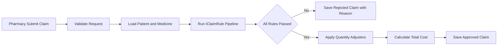

# Cryptid-Care Prescription Processor

Secure and extensible claims adjudication API for mythical patients, built with .NET 10 and SQL Server.

## Submission criteria (mapping)

| Expectation | Where it lives |
|-------------|----------------|
| **.NET 10** | Every project targets `net10.0` in its `.csproj`. |
| **MS SQL Server; Docker recommended** | `docker-compose.yml` runs SQL Server 2022 (`mcr.microsoft.com/mssql/server:2022-latest`) on port **1433** with a persisted volume. Local defaults in `appsettings*.json` point at that instance. |
| **Unit tests (meaningful core coverage)** | `CryptidCare.Tests` — `ClaimAdjudicationService` with **mocked** `IPatientRepository` / `IMedicineRepository` / `IClaimRepository`; covers rules (werewolf/silver, hydra heads, inactive patient), adjusters (hydra multiply vs non-hydra no-op), validation, not-found paths, rule pipeline short-circuit, and persisted rule audit entries. Run: `dotnet test CryptidCare.slnx`. |
| **Minimal architecture documentation** | This file: **Architecture notes**, **Design decisions and tradeoffs**, and the **Mermaid** claim flow below. Deeper reading is split into [`ARCHITECTURE.md`](ARCHITECTURE.md) (why), [`CONFIGURATION.md`](CONFIGURATION.md) (settings & secrets), and [`DEVELOPER_GUIDELINES.md`](DEVELOPER_GUIDELINES.md) (how to add a rule). |

## Project structure

- `CryptidCare.Api` - HTTP endpoints; `Configuration/Startup.cs` registers services via `WebApplicationBuilder` and configures the pipeline in `Configure`; OpenAPI helpers stay in `SwaggerExtensions.cs`.
- `CryptidCare.Application` - `Configuration/Startup.ConfigureServices` (adjudication, rules, adjusters); optional `IConfiguration` for future options / HttpClient settings.
- `CryptidCare.Domain` - entities and enums (no DI; stays dependency-free).
- `CryptidCare.Data` - `Configuration/Startup`: `ConfigureServices` (EF, repositories) and `ApplyPersistenceAsync` (migrations + seed).
- `CryptidCare.Tests` - unit tests for core business logic.

## Architecture notes

- Rules are pluggable via `IClaimRule`.
- The adjudicator loops over registered rules and stops on first failure.
- Quantity math is handled by `IQuantityAdjuster` so formula changes do not require changing the adjudicator.
- Persisted claim status is either `Approved` or `Rejected` with reason.



## Design decisions and tradeoffs

- **Pluggable rules (`IClaimRule`)** — New adjudication rules are added as separate classes and registered in DI. The adjudicator only loops the pipeline, so the core service stays stable (open/closed principle).
- **Adjusters separate from reject rules (`IQuantityAdjuster`)** — Safety and eligibility checks run on the *requested* quantity before any multiplication. Hydra math runs afterward, so rules like silver allergy are not accidentally evaluated against an adjusted quantity.
- **Rule audit trail (`ClaimRuleEvaluation`)** — Each rule outcome is persisted for explainability (useful for support, disputes, and debugging). The tradeoff is extra rows per claim and slightly more write work; for high volume, you could sample or archive old evaluations.
- **Layered projects** — Domain stays free of EF and HTTP concerns; Application holds orchestration; the Data project owns persistence. This improves testability at the cost of more projects and boilerplate.
- **Migrations at startup** — Convenient for local demos and the take-home; in production you would typically run migrations in a deployment step or job, not on every app start.
- **Auth** — Not in scope for the timebox. Production would add API keys or JWT, rate limiting, and integration tests (e.g. Testcontainers).
- **Observability** — Application Insights (OpenTelemetry-based SDK), request-scoped logging with correlation id, HTTP request logging (metadata only, no bodies), and global exception mapping to Problem Details.

## Azure Application Insights

The API uses [Microsoft.ApplicationInsights.AspNetCore](https://www.nuget.org/packages/Microsoft.ApplicationInsights.AspNetCore) (3.x), which exports traces, metrics, and `ILogger` output to Azure Monitor when a connection string is configured.

**Configuration (pick one):**

- **Environment variable (recommended in Azure):** `APPLICATIONINSIGHTS_CONNECTION_STRING` — copy from the Application Insights resource in the Azure portal (Overview → Connection String).
- **Configuration:** set `ApplicationInsights:ConnectionString` in `appsettings`, [User Secrets](https://learn.microsoft.com/en-us/aspnet/core/security/app-secrets), or Key Vault references.

If the connection string is empty, the app runs normally; telemetry is not sent.

**Optional:** set `APPLICATIONINSIGHTS_ROLE_NAME` (e.g. `CryptidCare.Api`) so the service name is clear in Application Map.

**Correlation:** each request gets an `X-Correlation-ID` (or accepts an incoming value). The same id is added to logger scopes and to the current `Activity` as tag `CorrelationId`, which appears on distributed traces in Application Insights. Request/response **bodies are not logged** (PHI / prescription safety).

A direct reference to `OpenTelemetry.Api` 1.15.3 is pinned to address a transitive vulnerability reported for 1.15.1.

## Configuration files and environments

Configuration loads in order: `appsettings.json`, then `appsettings.{Environment}.json`, then environment variables (which override JSON using `__` for nested keys, e.g. `ConnectionStrings__ClaimsDatabase`).

| File | Logging | Connection string |
|------|---------|---------------------|
| `appsettings.json` | `Default: Information`; framework namespaces `Warning`; `CryptidCare: Information` | Docker-style local SQL pointing at `localhost,1433` (matches `docker-compose.yml`) |
| `appsettings.Development.json` | `Default: Information` (override locally as needed) | Inherits from `appsettings.json` (override with environment variable or [User Secrets](https://learn.microsoft.com/en-us/aspnet/core/security/app-secrets)) |

For Staging/Production, do **not** check connection strings into source control — supply them via environment variables (e.g. `ConnectionStrings__ClaimsDatabase`) or Key Vault. `launchSettings.json` includes optional **Staging** and **Production** profiles for local checks that set the Docker SQL connection string in their environment block; remove those values from launch profiles in real deployments and supply secrets through your platform instead.

## Implemented business rules

1. Werewolf + silver medicine is rejected.
2. Hydra quantity is multiplied by patient head count.
3. Hydra with invalid head count is rejected.

## Authentication

The Claims endpoints require an **API key** in the `X-Api-Key` header. The expected key is read from `Authentication:ApiKey` (or env var `Authentication__ApiKey`).

- **Local development:** `appsettings.Development.json` ships a non-secret default of `dev-cryptidcare-local-key-change-me`. Override locally via [User Secrets](https://learn.microsoft.com/en-us/aspnet/core/security/app-secrets) if you prefer.
- **Production:** override via environment variable or a secret manager. `appsettings.json` does **not** contain a default — an unconfigured production deployment rejects every request with 401, by design.
- **Health endpoints** (`/health`, `/health/ready`, `/health/live`) are explicitly anonymous so Kubernetes/Docker probes work without credentials.

In Swagger UI, click the **Authorize** button (lock icon, top-right), paste the key, and every "Try it out" call will include the header automatically.

This is a deliberate stub demonstrating the seam where a real deployment would plug in **JWT bearer + OIDC** (e.g. Azure AD, Auth0) or **mTLS** between the pharmacy and Cryptid-Care. The handler lives at `CryptidCare.Api/Authentication/ApiKeyAuthenticationHandler.cs` and is ~50 lines.

## Creative wildcard feature

Each claim stores a rule-audit trail (`ClaimRuleEvaluation`) with:

- rule name
- pass/fail outcome
- rejection reason (if any)
- evaluation timestamp

This can be inspected through `GET /api/claims/{id}`.

## Running locally

**Database:** Running SQL Server in Docker is strongly recommended so the API, compose file, and documented password/port stay aligned.

1. Start SQL Server:
   - `docker compose up -d`
2. Apply migrations and run API (migrations + seed run automatically on startup):
   - `dotnet run --project CryptidCare.Api`
3. Run tests:
   - `dotnet test CryptidCare.slnx`

The API applies migrations and seeds demo data at startup (see `Program.cs` calling `Data.Configuration.Startup.ApplyPersistenceAsync`).

In **Development**, OpenAPI JSON and **Swagger UI** are enabled at `http://localhost:5020/swagger` (default `http` profile). The UI includes XML summaries when projects are built with documentation enabled, request-duration display, and try-it-out enabled by default.

**Health endpoints** (always on):

- `GET /health` — overall health of all checks.
- `GET /health/live` — liveness probe (process is up, business rules service responding).
- `GET /health/ready` — readiness probe (database reachable via EF Core).

## Seed data (for quick testing)

Patients:

- Werewolf: `11111111-1111-1111-1111-111111111111`
- Hydra (5 heads): `22222222-2222-2222-2222-222222222222`

Medicines:

- Non-silver: `aaaaaaaa-aaaa-aaaa-aaaa-aaaaaaaaaaaa`
- Silver: `bbbbbbbb-bbbb-bbbb-bbbb-bbbbbbbbbbbb`

## Sample requests

Rejected responses include stable `reasonCode` (enum name, e.g. `WerewolfSilverMedicine`) alongside human `reason` text; approved responses omit both.

Invalid request bodies (empty GUIDs, non-positive `quantity`, and similar) return **400** immediately with a `ValidationProblemDetails` payload (`errors` per field) and **no** claim is created—before adjudication runs. Adjudication rejections also use **400** but return the claim-shaped JSON (`claimId`, `status`, `reason`, `reasonCode`).

Approve sample:

```bash
curl -X POST "http://localhost:5020/api/claims" \
  -H "Content-Type: application/json" \
  -H "X-Api-Key: dev-cryptidcare-local-key-change-me" \
  -d "{\"patientId\":\"22222222-2222-2222-2222-222222222222\",\"medicineId\":\"aaaaaaaa-aaaa-aaaa-aaaa-aaaaaaaaaaaa\",\"quantity\":2}"
```

Reject sample:

```bash
curl -X POST "http://localhost:5020/api/claims" \
  -H "Content-Type: application/json" \
  -H "X-Api-Key: dev-cryptidcare-local-key-change-me" \
  -d "{\"patientId\":\"11111111-1111-1111-1111-111111111111\",\"medicineId\":\"bbbbbbbb-bbbb-bbbb-bbbb-bbbbbbbbbbbb\",\"quantity\":1}"
```

Calls without the `X-Api-Key` header (or with a wrong key) return **401 Unauthorized**.

